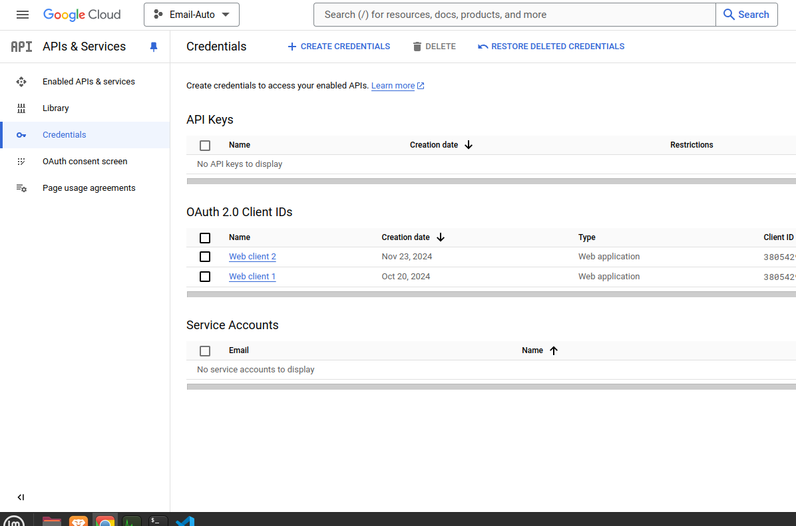

# This file includes useful information about the project.

## C++ DLL/SO

- DLL stands for Dynamic Link Library, a type of file used in Windows operating systems to store compiled code that can be used by multiple programs simultaneously. 
A DLL file contains code, data, and resources that programs can call during runtime to perform specific functions or tasks, without having to have those functions coded directly into the application.

- .so stands for Shared Object. These are shared libraries used on Unix-based systems (like Linux). They are similar to .dll (Dynamic Link Library) files on Windows.
Shared libraries allow code to be modular and reusable, reducing memory usage since multiple programs can share the same library at runtime.

Here, we write the business logic for Sending the Email and create a DLL/SO to use in external projects during runtime.
We can use cURL to send Emails through Gmail API.

### cURL (Client URL)
It is a command-line tool and library for transferring data with URLs. It supports a wide variety of protocols, including HTTP, HTTPS, FTP, SMTP, and more, making it a powerful tool for interacting with web services and APIs. The Gmail API allows you to send emails programmatically. Using cURL, you can make HTTP requests to Gmail's API endpoints.

## Using Base64 Encoding in Sending Email Data to Gmail API

Base64 is a binary-to-text encoding scheme that converts binary data into an ASCII string format. It represents binary data using only 64 printable characters, ensuring the data is safe to transmit over text-based systems like email, HTTP, or JSON.
The name "Base64" comes from the fact that it uses 64 characters in its encoding scheme.

The Gmail API expects the email message content to be provided in a Base64 encoded format within the "raw" field of the JSON payload.
- Emails are essentially a mix of text and binary data (e.g., attachments, special characters). Base64 converts binary data into an ASCII string format, ensuring compatibility with text-based communication protocols like HTTP.
- This encoding avoids issues with special characters that might interfere with HTTP transmission, such as newline characters, control characters, or non-ASCII symbols.
- The Gmail API specifically mandates that the email data be encoded using Base64 URL-safe encoding. This ensures the data adheres to URL encoding rules.

### Base64 Encoding
The raw email is encoded in Base64 format.
Standard Base64 Encoding: Converts the raw message into a Base64-encoded string.
URL-Safe Base64 Encoding: Modifies the Base64 string by:

Replacing + with -.
Replacing / with _.
Removing trailing = padding.

Certain communication channels, like JSON or URL parameters, might misinterpret special characters (e.g., +, /, or =).
Base64 makes the data readable and safe for these channels. This step ensures the encoded data is safe for inclusion in URLs or JSON payloads.


#### Base64 Character Set
The 64 characters used in Base64 encoding are:

```ABCDEFGHIJKLMNOPQRSTUVWXYZ    // A-Z (26 characters)
abcdefghijklmnopqrstuvwxyz    // a-z (26 characters)
0123456789                   // 0-9 (10 characters)
+ /                          // Two special characters
```

## Getting the Access Token

### Google Cloud Console
The Google Cloud Console is a web-based interface provided by Google for managing Google Cloud services and APIs. It allows developers to create and manage projects, enable APIs, configure authentication, monitor usage, and access resources like databases, virtual machines, and more.

For applications interacting with Google APIs (e.g., Gmail, Google Drive), the Cloud Console is essential to configure OAuth 2.0 credentials, such as the Client ID and Client Secret, required for authorization.

### Steps to Use Google Cloud Console to Obtain Client ID and Secret

1. Login on Google Cloud Console, open or create a new project.
2. Go to APIs & Services > Library in the sidebar. Search for the API you need (e.g., "Gmail API").


3. Navigate to APIs & Services > Credentials. Click Create Credentials > OAuth 2.0 Client ID





## Note: Add Redirect URI ( URLs where users will be redirected after authentication) as "https://developers.google.com/oauthplayground".


### OAuth 2.0
- OAuth 2.0: OAuth 2.0 is an open authorization standard that allows third-party applications to access a user's resources (e.g., Gmail, Google Drive) without exposing their credentials. Instead, it uses access tokens to grant limited access.
- Google OAuth 2.0 Playground: The Google OAuth 2.0 Playground is a tool provided by Google to help developers test and understand the OAuth 2.0 flow for Google APIs. It simplifies obtaining authorization tokens and making API calls in a controlled environment.

Google APIs such as Gmail API and others require authentication and authorization to ensure only authorized applications or users can access resources. OAuth 2.0:

1. Provides a secure, standardized way to grant access.
2. Reduces the need for sharing passwords.
3. Limits access using scopes, specifying what the token can do (e.g., read emails but not send them).

Since we want to access the Gmail of a specific user and use it in our code to send emails, we need to authenticate and authorize so that we have access to Gmail APIs using that email and we can use the required services.

### How OAuth 2.0 Works
1. Authorization Code Flow (for server-side applications):
- User Consent: The app asks the user for permission to access resources.
- Authorization Code: Google sends an authorization code to the app.
- Token Exchange: The app exchanges the code for an access token and refresh token.

2. Implicit Flow (for client-side apps):
The app directly receives an access token without a server-side exchange.

3. Service Account Flow (for server-to-server communication):
Used when an app needs access to resources without user interaction.


Add your Client Id and Client Secret to Authorize


Select the APIs you want to access


Get the Access Token and add it in the code!


## C# Console App

### .NET
.NET is a software development framework created by Microsoft that provides tools, libraries, and runtime environments to develop applications. It supports multiple programming languages, including C#, F#, and Visual Basic. Developers use .NET to build various types of applications, including desktop, web, mobile, cloud, gaming, and IoT apps.

When we use .NET to make C# console applications, it creates lightweight command-line programs.